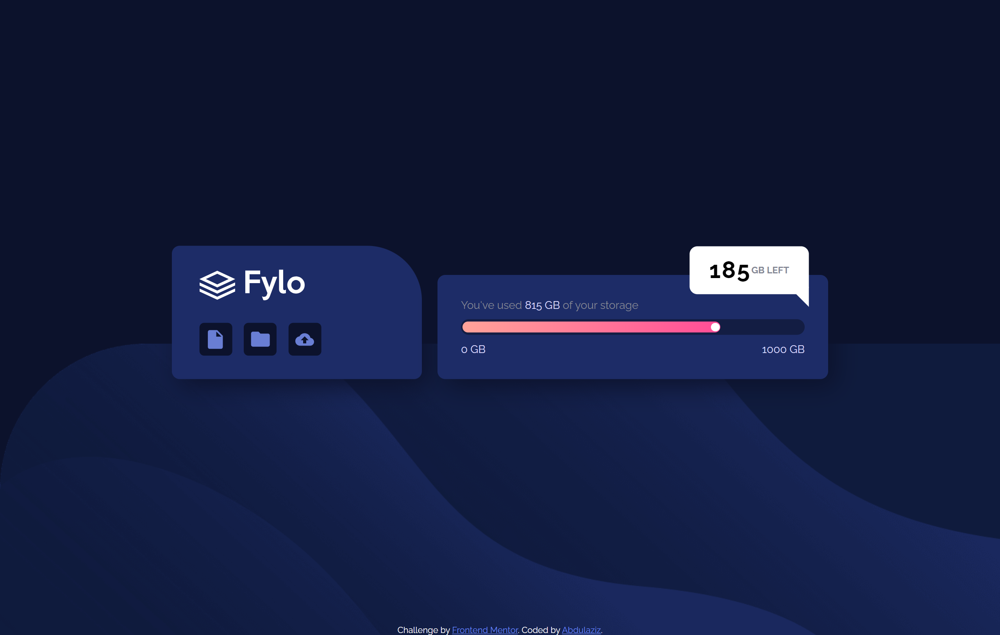
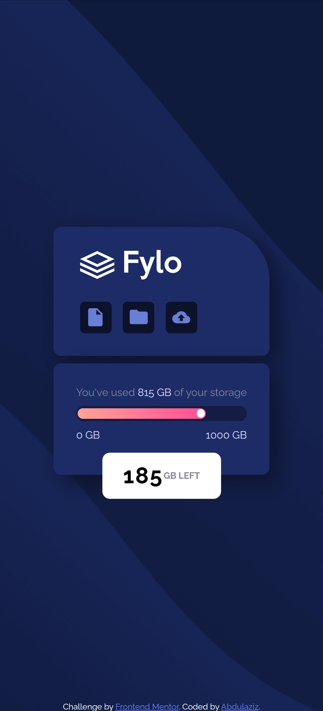

# Frontend Mentor - Fylo data storage component solution

This is a solution to the [Fylo data storage component challenge on Frontend Mentor](https://www.frontendmentor.io/challenges/fylo-data-storage-component-1dZPRbV5n). Frontend Mentor challenges help you improve your coding skills by building realistic projects.

## Overview

### The challenge

Users should be able to:

- View the optimal layout for the site depending on their device's screen size

### Screenshot

### Links

- Solution URL: [Take a look](https://www.frontendmentor.io/solutions/fylo-data-storage-component-using-flexbox-6iu5foEOBA)
- Live Site URL: [Take a look](https://abdulaziz-m895.github.io/Fylo-data-storage-component/)

## My process

### Built with

- Semantic HTML5 markup
- CSS custom properties
- Flexbox

## Author

- Frontend Mentor - [@abdulaziz-M895](https://www.frontendmentor.io/profile/abdulaziz-M895)
- LinkedIn - [@abdulaziz-omran](https://www.linkedin.com/in/abdulaziz-omran/)
